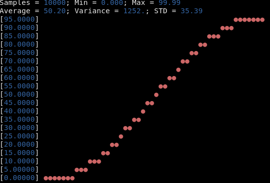
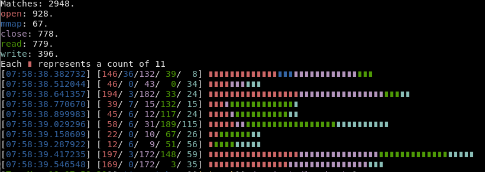

# lowcharts
Tool to draw low-resolution graphs in terminal.

[](https://github.com/juan-leon/lowcharts/actions/workflows/test.yml)
[](https://codecov.io/gh/juan-leon/lowcharts)
[](https://deps.rs/repo/github/juan-leon/lowcharts)
[](https://github.com/juan-leon/lowcharts/releases/latest)

**lowcharts** is meant to be used in those scenarios where we have numerical
data in text files that we want to display in the terminal to do a basic
analysis.

An example would be the logs of a service (webserver, database, proxy, container
orchestration, etc.) where times (or sizes) of requests are logged.  In an ideal
world you would have those logs accessible via a kibana (or similar) or those
metrics exposed to a prometheus (or similar) and graphed in a grafana dashboard
(or similar).  But sometimes we need to cope with non ideal worlds, and
troubleshoot a service with nothing more of what we can muster in a shell
terminal.

### Usage

Type `lowcharts --help`, or `lowcharts PLOT-TYPE --help` for a complete list of
options.

Currently five basic types of plots are supported:

#### Bar chart for matches in the input

Since `grep -c` does not aggregate counts per pattern, this is maybe my most frequent use case.

This chart is generated using `lowcharts matches database.log SELECT UPDATE DELETE INSERT DROP`:

[](resources/matches-example.png)

#### Histogram

This chart is generated using `python3 -c 'import random; [print(random.normalvariate(5, 5)) for _ in range(100000)]' | lowcharts hist`:

[](resources/histogram-example.png)

This was inspired by [data-hacks](https://github.com/bitly/data_hacks).
However, for some big log files I found that project was slower of what I would
like, and I found that a rust-compiled binary was better suited to my needs.


Options for specifying ranges, chart sizes and input files are supported:

```
lowcharts hist --max 0.5 --intervals 10 --width 50 data.txt
Samples = 50090; Min = 0.000; Max = 0.499
Average = 0.181; Variance = 0.023; STD = 0.154
each ∎ represents a count of 484
[0.000 .. 0.050] [14545] ∎∎∎∎∎∎∎∎∎∎∎∎∎∎∎∎∎∎∎∎∎∎∎∎∎∎∎∎∎∎
[0.050 .. 0.100] [ 6111] ∎∎∎∎∎∎∎∎∎∎∎∎
[0.100 .. 0.150] [ 4911] ∎∎∎∎∎∎∎∎∎∎
[0.150 .. 0.200] [ 4003] ∎∎∎∎∎∎∎∎
[0.200 .. 0.250] [ 3745] ∎∎∎∎∎∎∎
[0.250 .. 0.300] [ 3526] ∎∎∎∎∎∎∎
[0.300 .. 0.350] [ 3424] ∎∎∎∎∎∎∎
[0.350 .. 0.400] [ 3332] ∎∎∎∎∎∎
[0.400 .. 0.450] [ 3215] ∎∎∎∎∎∎
[0.450 .. 0.500] [ 3278] ∎∎∎∎∎∎
```

Above examples assume input files with a number per line.  Options for figuring
out where to look in the input file for values are supported by `regex` option.
This example logs the time spent by nginx for all of 200K http responses ()


```
$ cat nginx*.log | lowcharts hist --regex ' 200 \d+ ([0-9.]+)' --intervals 10
Samples = 25080; Min = 0.004; Max = 0.049
Average = 0.008; Variance = 0.000; STD = 0.006
each ∎ represents a count of 228
[0.004 .. 0.009] [20569] ∎∎∎∎∎∎∎∎∎∎∎∎∎∎∎∎∎∎∎∎∎∎∎∎∎∎∎∎∎∎∎∎∎∎∎∎∎∎∎∎∎∎∎∎∎∎∎∎∎∎∎∎∎∎∎∎∎∎∎∎∎∎∎∎∎∎∎∎∎∎∎∎∎∎∎∎∎∎∎∎∎∎∎∎∎∎∎∎∎∎
[0.009 .. 0.013] [ 1329] ∎∎∎∎∎
[0.013 .. 0.018] [  807] ∎∎∎
[0.018 .. 0.022] [ 1412] ∎∎∎∎∎∎
[0.022 .. 0.027] [  363] ∎
[0.027 .. 0.031] [   27]
[0.031 .. 0.036] [  128]
[0.036 .. 0.040] [   22]
[0.040 .. 0.044] [  240] ∎
[0.044 .. 0.049] [  183]
```

#### X-Y Plot

This chart is generated using  `cat ram-usage | lowcharts plot --height 20 --width 50`:

[](resources/plot-example.png)

Note that x axis is not labelled.  The tool splits the input data by chunks of a
fixed size and then the chart display the averages of those chunks.  In other
words: grouping data by time is not (yet?) supported; you can see the evolution
of a metric over time, but not the speed of that evolution.

There is regex support for this type of plots.

#### Time Histogram

This chart is generated using  `strace -tt ls -lR * 2>&1 | lowcharts timehist --intervals 10`:

[](resources/timehist-example.png)

Things like `lowcharts timehist --regex ' 404 ' nginx.log` should work in a
similar way, and would give you a glimpse of when and how many 404s are being
triggered in your server.

The idea is to depict the frequency of logs that match a regex (by default any
log that is read by the tool).  The sub-command can autodetect the more common
(in my personal and biased experience) datetime/timestamp formats: rfc 3339, rfc
2822, python `%(asctime)s`, golang default log format, nginx, rabbitmq, strace
-t (or -tt, or -ttt),ltrace,... as long as the timestamp is present in the first
line in the log and the format is consistent in all the lines that contain
timestamp.  It is ok to have lines with no timestamp.  The consistency is
required because of performance reasons: the 1st log line is the only one that
triggers the heuristics needed to create an specialized datetime parser on the
fly.

However, if you have a format that lowcharts cannot autodetected, you can
specify it via command line flag.  For instance, `--format
'%d-%b-%Y::%H:%M:%S'`.  Note that, as of today, you need to leave out the
timezone part of the format string (the autodetection works fine with
timezones).


#### Split Time Histogram

This adds up the time histogram and bar chart in a single visualization.

This chart is generated using  `strace -tt ls -lR 2>&1 | lowcharts split-timehist open mmap close read write --intervals 10`:

[](resources/split-timehist-example.png)

This graph depicts the relative frequency of search terms in time.

### Installing

#### Via release

Go over https://github.com/juan-leon/lowcharts/releases/ and download the binary
you want.  Decompress the file and copy the binary to your path.

#### Via local compilation

```
$ git clone https://github.com/juan-leon/lowcharts
$ cd lowcharts
$ cargo install --path .
```

### Contributing

Feedback, ideas and pull requests are welcomed.
